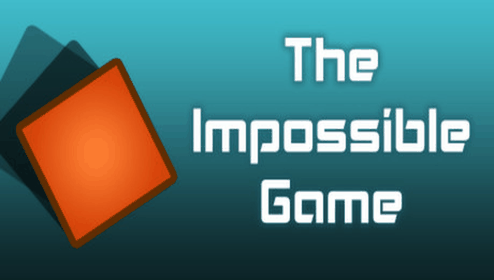

# THE IMPOSSIBLE GAME — PS Vita Port

<p align="center">
  
</p>

<p align="center">
  <b>Native port of The Impossible Game (FlukeDude) for PlayStation Vita and PlayStation TV.</b>
</p>

<p align="center">
  
  
  
  
  
</p>

---

## 📖 Description

**The Impossible Game** is FlukeDude's rhythm-platformer, originally released for Android as
`05133-the-impossible-1.5.2.apk` (package `com.flukedude.impossiblegame`). This port runs the
compiled native library (`libimpossible.so` — a small, self-contained proprietary engine that
handles cube physics, collisions, procedural level generation, and rendering) directly on the
PS Vita's ARM Cortex-A9 processor, using a dynamic loader (*soloader*) and an Android
environment emulation layer (*FalsoJNI*). The UI and audio layers, which were Java on Android,
have been fully reimplemented natively in C (`menu.c`, `audio.c`, `texture.c`, `save.c`) for
zero-latency input and native performance.

`libimpossible.so` makes **zero callbacks into Java/JNIEnv** — it only imports standard math
(`cosf`, `sinf`, `round`, `truncf`, `lrand48`), `clock_gettime`, and OpenGL ES 1.1 fixed-function
calls (`glVertexPointer`, `glTexCoordPointer`, `glDrawArrays`, ...), rendered via
[vitaGL](https://github.com/Rinnegatamante/vitaGL). See [`PORTING_PLAN.md`](PORTING_PLAN.md) for
the full engine-detection write-up and the confirmed native lifecycle
(`initLibrary` → `initGame` → `drawFrame`).

### 🎮 Current Status: Playable

The game **boots to the main menu and both bundled levels (Fire Aura, Original Xbox Level) are
fully playable** — graphics, audio, touch and physical-button input, and save data (medals,
attempts, jumps, per-level progress) all confirmed working on real hardware. See
[`port_progress.md`](port_progress.md) for the full bug-by-bug diagnosis log (every fix is
backed by a real console log — no guessing).

### ✨ What Works

- **Native ARM Execution**: `libimpossible.so` (armeabi-v7a) runs directly on the Vita's CPU via
  the soloader — no interpretation/emulation of game code.
- **Full Native UI**: all 7 menu states (main menu, level select, pause, how-to-play, stats,
  medals, victory) reimplemented in C, with dual touch + D-Pad/face-button navigation.
- **vitaGL Graphics Pipeline**: OpenGL ES 1.1 fixed-function rendering (vertex arrays, ortho
  projection, blending) at native 960×544, built **from source** as a vendored submodule (see
  Building from Source below — this was required to fix a persistent black-screen bug).
- **Full Audio**: dedicated multithreaded `SceAudioOut` mixer (44.1kHz stereo), streaming BGM
  (menu/gameplay/practice tracks) and preloaded, latency-free SFX, all decoded from Ogg Vorbis
  via `stb_vorbis`.
- **Complete Input Mapping**: Cross/D-Pad-Up to jump, Triangle/R1 to place a practice flag,
  Square/L1 to remove it, Start/Circle to pause — plus full front-touch-panel support, mapped
  1:1 to both menu navigation and in-game touch-to-jump.
- **Persistent Save Data**: jumps, attempts, unlocked medals, and per-level/per-mode progress
  saved to `ux0:data/theimpossiblegame/save.dat`, synced bidirectionally with the native
  library's own getters/setters.
- **Incremental File Logging**: every run writes a fresh `logs/log_NNN.log`, used throughout
  triage on real hardware (see `source/utils/logger.c`).

### ⚠️ Known Issues / Pending Work

- **World/level packs not yet ported**: the base game (this APK) only ships two levels (Fire
  Aura and the Original Xbox Level). FlukeDude's additional "world pack" content is distributed
  as a **separate APK** and hasn't been analyzed or integrated yet — planned as future work.

---

## 📋 Prerequisites

To run this port on your PS Vita or PS TV, you will need:

1. A PS Vita / PS TV console running Custom Firmware (**HENkaku** or **Enso**),
   firmware 3.60/3.65 or later recommended.
2. [**kubridge**](https://github.com/TheOfficialFloW/kubridge/releases) installed as a kernel
   plugin (`ur0:tai/config.txt` under `*KERNEL`).
3. [**libshacccg.suprx**](https://github.com/Rinnegatamante/ShaRKBR33D/releases/latest)
   installed in `ur0:data/` (required by vitaGL's fixed-function shader compiler).
4. A legally obtained copy of **The Impossible Game** for Android
   (`05133-the-impossible-1.5.2.apk`, package `com.flukedude.impossiblegame`).

---

## 📦 Installation Instructions

1. Install the `theimpossiblegame.vpk` file on your console using **VitaShell**.
2. On your PC, place `05133-the-impossible-1.5.2.apk` in the project root (or extract it into
   `theimpossiblegame_extract/`).
3. Use **psvita-port-toolkit** (the standalone tool this port is managed with) to extract
   `libimpossible.so` from the APK and prepare the asset files — open the toolkit and select
   "Continuar con un port existente" pointing at this folder.
4. Transfer the resulting game data to `ux0:data/theimpossiblegame/` via FTP or USB using
   VitaShell.

### Final File Structure in `ux0:data/theimpossiblegame/`

```text
ux0:data/theimpossiblegame/
├── libimpossible.so   <- Native library extracted from the APK
├── res/               <- Textures (drawable/) and audio (raw/, .ogg)
├── assets/            <- Fonts and other packaged assets
├── logs/              <- Incremental debug logs (log_NNN.log)
└── save.dat           <- Created at runtime (jumps, attempts, medals, progress)
```

---

## 🛠️ Building from Source

This port does **not** keep a local copy of `porting_tools/` — all build, deploy, log, and
LiveArea workflows are handled by **psvita-port-toolkit**, a standalone tool kept outside this
repository.

vitaGL is vendored as a **git submodule** (`lib/vitagl`) and compiled from source by
`CMakeLists.txt` itself, instead of linking the prebuilt `libvitaGL.a` from the global VitaSDK
install — a hand-patched copy of that global library was the confirmed root cause of a
persistent, silent black-screen bug (audio and game logic ran fine; the framebuffer itself was
never written to). Building vitaGL from source, pinned by this project, avoids depending on
that shared, mutable state. See `port_progress.md` for the full diagnosis.

### Build Prerequisites

- **VitaSDK**, fully compiled with softfp usage (`vitasdk-softfp/vdpm`).
- VitaSDK libraries: `vitashark`, `kubridge`, `pthread`.
- CMake and Make.
- Run `git submodule update --init` before the first build (fetches `lib/vitagl`).

### Build Steps

```bash
git submodule update --init
cmake -Bbuild .
cmake --build build
```

This produces `build/theimpossiblegame.vpk`. For day-to-day development (build + deploy + log
fetching), use **psvita-port-toolkit** instead of raw `cmake`/`make`.

---

## 🏗️ Project Structure

- `source/`: Native C loader — lifecycle (`main.c`), and the native reimplementations of the
  Android UI/audio/persistence layers (`menu.c`, `audio.c`, `texture.c`, `save.c`).
- `source/utils/`: Loader plumbing — SO relocation/init (`init.c`), vitaGL setup (`glutil.c`),
  incremental file logger (`logger.c`), fatal-error dialogs (`dialog.c`).
- `lib/`: Auxiliary libraries (`so_util`, `falso_jni`, `vitagl` — git submodule, built from
  source, see above —, `libc_bridge`, `fios`, `sha1`, `stb_image.h`, `stb_vorbis.c`).
- `extras/`: LiveArea assets (`icon0.png`, `bg0.png`, `pic0.png`, `startup.png`,
  `template.xml`).
- `PORTING_PLAN.md`: Living plan — engine findings, JNI export table, checklist.
- `port_progress.md`: Bug-by-bug diagnosis log, one confirmed bug at a time, backed by real
  console logs.

---

## ⚖️ Disclaimer

**The Impossible Game** is a registered trademark of FlukeDude. The work presented in this
repository is not "official" or produced or sanctioned by FlukeDude or any other registered
trademark mentioned in this repository.

This software does not contain the original code, executables, assets, or other
non-redistributable parts of the original game product. The authors of this work do not
promote or condone piracy in any way. To launch and play the game on their PS Vita device,
users must possess their own legally obtained copy of the game in the form of an `.apk` file.

---

## 👥 Credits and Acknowledgements

- **FlukeDude**: Original developer of The Impossible Game.
- **TheFloW**: For `so_util`, `kubridge`, and foundational techniques for loading Android
  executables on PS Vita.
- **Rinnegatamante**: For `vitaGL`/`vitaShaRK` and continued support to the PS Vita porting
  scene.
- **v-atamanenko**: For `FalsoJNI` and the `soloader-boilerplate` base template.
- **Sean Barrett (nothings)**: For `stb_image.h` and `stb_vorbis.c`, used for texture and Ogg
  Vorbis audio decoding.
- **Vita Community**: To all developers and enthusiasts in the PS Vita homebrew community.

---

## License

This software may be modified and distributed under the terms of the MIT license.
See the [LICENSE](LICENSE) file for details.
